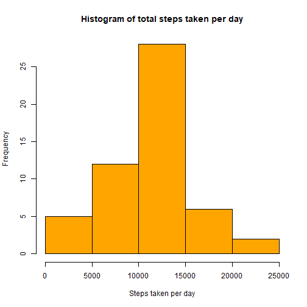
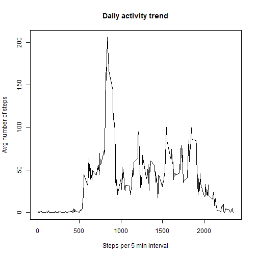
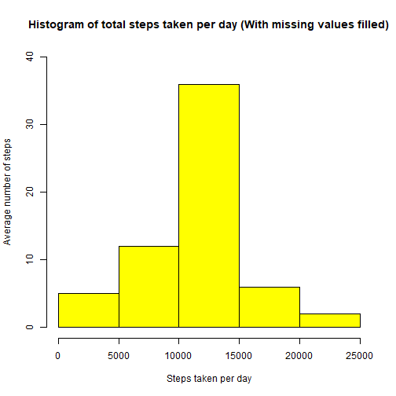
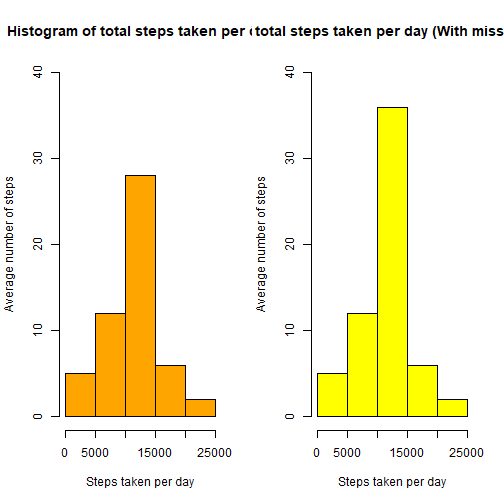
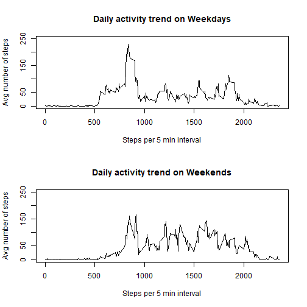

## Coursera Reproducible Research - Assignment 1


```r
# Load packages
library(knitr)
library(dplyr)

# Download data for the assignment
url <- "https://d396qusza40orc.cloudfront.net/repdata%2Fdata%2Factivity.zip"
file_name <- "Factivity.zip"
if (!file.exists(file_name)){
  download.file(url, destfile = file_name)
  unzip(file_name, exdir = ".") # Unzip the file
}

# Read in the CSV file into a variable
act <- read.csv("activity.csv")

# Review structure of the variable
str(act)
```

```
## 'data.frame':	17568 obs. of  3 variables:
##  $ steps   : int  NA NA NA NA NA NA NA NA NA NA ...
##  $ date    : chr  "2012-10-01" "2012-10-01" "2012-10-01" "2012-10-01" ...
##  $ interval: int  0 5 10 15 20 25 30 35 40 45 ...
```

```r
# Change the data type of the date column in the table because it is in date format
act$date <- as.Date(act$date)
```


#### 1. What is the mean total number of steps taken per day?

```r
# Remove records with missing steps data (allowed per assignment instructions)
act_clean <- act[!is.na(act$steps),]

# Aggregate the steps to the days
act_day <- tapply(act_clean$steps, act_clean$date, sum)

# Plot histogram of total number of steps taken per day
hist(act_day, xlab = "Steps taken per day", main = "Histogram of total steps taken per day", col = "orange")
```




Mean of the total number of steps taken is:

```r
mean(act_day)
```

```
## [1] 10766.19
```


Median of the total number of steps taken is:

```r
median(act_day)
```

```
## [1] 10765
```


#### 2. What is the average daily activity pattern?

```r
# Apply mean on the cleaned table
act_pattern <- tapply(act_clean$steps, act_clean$interval, mean)

# Plot the chart
plot(y = act_pattern, x = names(act_pattern), type = "l", xlab = "Steps per 5 min interval", ylab = "Avg number of steps", main = "Daily activity trend")
```




Interval with maximum average number of steps throughout the days:

```r
act_pattern[act_pattern == max(act_pattern)]
```

```
##      835 
## 206.1698
```


#### 3. Imputing missing values
Records with msising values in dataset:

```r
# Get count of all the NA records
sum(is.na(act$steps))
```

```
## [1] 2304
```

The mean of the steps taken in 5 minute intervals will be used as the strategy to fill the missing values. A new variable will be created.

```r
# Fill the NA values with the mean of the day steps taken
act_filled <- act
act_filled[which(is.na(act_filled$steps)),1]<-
        act_pattern[as.character(act_filled[which(is.na(act_filled$steps)),3])]
```


Histogram plot of the number of steps taken per day in the new dataset (NAs filled up with mean data)

```r
# Aggregate the new steps taken from new dataset
act_filled_day <- tapply(act_filled$steps, act_filled$date, sum)

# Plot histogram of steps taken in the new dataset
hist(act_filled_day, xlab = "Steps taken per day", ylab = "Average number of steps", main = "Histogram of total steps taken per day (With missing values filled)", ylim = c(0,40), col = "yellow")
```



```r
# Get median and mean of the new dataset
```


Mean of the total number of steps taken is:

```r
mean(act_filled_day)
```

```
## [1] 10766.19
```


Median of the total number of steps taken is:

```r
median(act_filled_day)
```

```
## [1] 10766.19
```


Impact on missing data:

```r
par(mfrow=c(1,2))
hist(act_day, xlab = "Steps taken per day", ylab = "Average number of steps", main = "Histogram of total steps taken per day", ylim = c(0,40), col = "orange")
hist(act_filled_day, xlab = "Steps taken per day", ylab = "Average number of steps", main = "Histogram of total steps taken per day (With missing values filled)", ylim = c(0,40), col = "yellow")
```




Impact from the missing data:

```r
median(act_filled_day) - median(act_day)
```

```
## [1] 1.188679
```

#### 4.Are there differences in activity patterns between weekdays and weekends?

```r
# Determine weekend or weekday from the date then split into weekday and weekend variable respectively
act_filled$day_type<- ifelse(as.POSIXlt(act_filled$date)$wday %in% c(0,6), "we","wd")

act_wd <- subset(act_filled, day_type == "wd")
act_wd_daily <- tapply(act_wd$steps, act_wd$interval, mean)

act_we <- subset(act_filled, day_type == "we")
act_we_daily <- tapply(act_we$steps, act_we$interval, mean)

# Plot the two datasets
par(mfrow=c(2,1))
plot(y = act_wd_daily, x = names(act_wd_daily), type = "l", xlab = "Steps per 5 min interval", main = "Daily activity trend on Weekdays", ylab = "Avg number of steps", ylim =c(0, 250))
plot(y = act_we_daily, x = names(act_we_daily), type = "l", xlab = "Steps per 5 min interval", main = "Daily activity trend on Weekends", ylab = "Avg number of steps", ylim =c(0, 250))
```



From the two charts, we can see that there is concentration of activity on the weekdays under 1,000 steps per 5 minute interval. The weekends however, see balanced distribution of activity between a wide level of 750 to 2000 steps per 5 minute interval. 
